# RAF Marketplace — Entity Relationship Diagram

The diagram below renders automatically on GitHub. It shows the core entities
and their relationships; lookup/junction tables are included where they carry
meaning. See `schema.sql` for every column and constraint.

```mermaid
erDiagram
    app_user        ||--o{ user_role        : has
    role            ||--o{ user_role        : grants
    role            ||--o{ role_permission  : includes
    permission      ||--o{ role_permission  : in
    app_user        ||--o{ auth_session     : opens
    app_user        ||--o{ activity_log     : generates
    app_user        ||--o{ address          : owns

    app_user        ||--o| vendor           : owns
    vendor          ||--o{ vendor_staff     : employs
    app_user        ||--o{ vendor_staff     : "works as"
    vendor          ||--|| vendor_wallet    : has
    vendor          ||--o{ payout           : requests
    vendor          ||--o{ wallet_transaction : ledger

    country         ||--o{ region           : contains
    region          ||--o{ city             : contains
    city            ||--o{ address          : locates

    category        ||--o{ category         : "parent of"
    category        ||--o{ product          : groups
    brand           ||--o{ product          : labels
    vendor          ||--o{ product          : sells
    product         ||--o{ product_variant  : "has SKUs"
    product         ||--o{ product_image    : shows
    product_variant ||--|| inventory        : "tracked by"
    attribute       ||--o{ attribute_value  : defines
    product_variant ||--o{ variant_attribute : "has"
    attribute_value ||--o{ variant_attribute : "used in"

    app_user        ||--o{ cart             : keeps
    cart            ||--o{ cart_item        : holds
    product_variant ||--o{ cart_item        : "added as"
    app_user        ||--o{ wishlist_item    : saves
    product         ||--o{ wishlist_item    : "saved in"
    app_user        ||--o{ review           : writes
    product         ||--o{ review           : receives

    app_user        ||--o{ customer_order   : places
    customer_order  ||--o{ order_item       : contains
    product_variant ||--o{ order_item       : "sold as"
    vendor          ||--o{ order_item       : fulfills
    order_item      ||--o{ return_request   : "may have"

    customer_order  ||--o{ payment          : "paid by"
    payment         ||--o{ refund           : "may refund"
    return_request  ||--o{ refund           : triggers

    customer_order  ||--o{ shipment         : "shipped via"
    vendor          ||--o{ shipment         : ships
    shipment        ||--o{ shipment_event   : "tracked by"

    app_user        ||--o{ notification     : receives
    app_user        ||--o{ device_token     : registers

    app_user        ||--o{ ai_chat_session  : "talks in"
    ai_chat_session ||--o{ ai_chat_message  : contains
    app_user        ||--o{ ai_recommendation : "targeted by"
    product         ||--o{ ai_recommendation : recommends
    vendor          ||--o{ ai_forecast      : forecasts
    vendor          ||--o{ ai_job           : queues
    vendor          ||--o{ marketing_campaign : runs
    vendor          ||--o{ coupon           : issues

    app_user {
        bigint  user_id PK
        citext  email UK
        bool    twofa_enabled
        enum    status
    }
    vendor {
        bigint  vendor_id PK
        bigint  owner_user_id FK
        enum    status
        numeric commission_rate
    }
    product {
        bigint  product_id PK
        bigint  vendor_id FK
        text[]  tags
        enum    status
    }
    product_variant {
        bigint  variant_id PK
        varchar sku UK
        varchar barcode UK
        numeric price
    }
    customer_order {
        bigint  order_id PK
        varchar order_number UK
        enum    status
        numeric grand_total
    }
    order_item {
        bigint  order_item_id PK
        bigint  order_id FK
        bigint  vendor_id FK
        numeric commission_amount
    }
    payment {
        bigint  payment_id PK
        enum    gateway
        enum    status
    }
    shipment {
        bigint  shipment_id PK
        enum    carrier
        enum    status
    }
```

> Legend: `||--o{` = one-to-many, `||--||` = one-to-one, `||--o|` = one-to-(zero/one).
