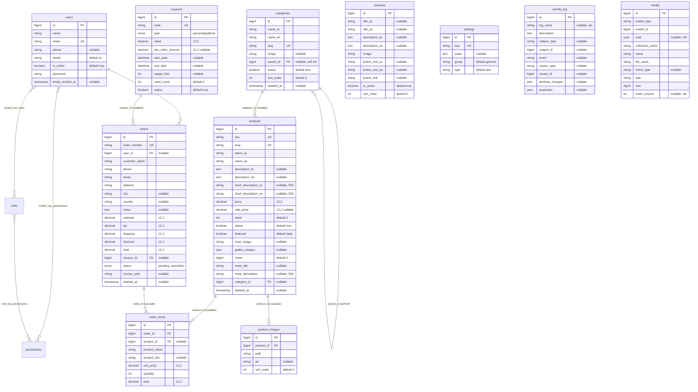

# Entity Relationship Diagram

This document describes the database schema for the multilingual e-commerce
platform. It is generated from the actual migrations in
`database/migrations/` and the Eloquent models in `app/Models/`.

## Overview

The schema is organized around four areas:

- **Catalog** — `categories`, `products`, `product_images`
- **Sales** — `orders`, `order_items`, `coupons`
- **Content / configuration** — `banners`, `settings`
- **Identity & authorization** — `users` + Spatie permission tables
- **Cross-cutting** — `activity_log`, `media`

Soft deletes (`deleted_at`) are enabled on `categories`, `products`, and
`orders`.

## Mermaid ER Diagram

## Cardinality summary

| Relationship | Type | Notes |
|---|---|---|
| `categories` → `categories` | 1 : N (self) | `parent_id`, `nullOnDelete`. Root categories have `parent_id = NULL`. |
| `categories` → `products` | 1 : N | `category_id`, `nullOnDelete` (product survives category deletion). |
| `products` → `product_images` | 1 : N | `product_id`, `cascadeOnDelete`. |
| `products` → `order_items` | 1 : N | `product_id`, `nullOnDelete` (order history is preserved). |
| `orders` → `order_items` | 1 : N | `order_id`, `cascadeOnDelete`. |
| `coupons` → `orders` | 1 : N | `coupon_id`, `nullOnDelete`. |
| `users` → `orders` | 1 : N | `user_id`, `nullOnDelete` (guest checkout allowed). |
| `users` ↔ `roles` / `permissions` | M : N | Spatie pivots (polymorphic on the model). |

---

## Table-by-table breakdown

### users

`0001_01_01_000000_create_users_table.php` + `2026_06_13_170009_add_fields_to_users_table.php`

| Column | Type | Constraints / Notes |
|---|---|---|
| id | bigint unsigned | PK, auto-increment |
| name | string | |
| email | string | UNIQUE |
| email_verified_at | timestamp | nullable |
| password | string | hashed (cast `hashed`) |
| remember_token | string | |
| phone | string | nullable (added) |
| locale | string(5) | default `ar` (added) |
| is_active | boolean | default `true` (added) |
| created_at / updated_at | timestamps | |

Model: `App\Models\User` — uses `HasRoles` (Spatie), `Notifiable`. Relations:
`orders()`. Helper `isAdmin()` checks `Super Admin|Admin|Content Manager`.
Companion tables created in the same migration: `password_reset_tokens`
(PK `email`) and `sessions` (PK `id`, indexed `user_id`, `last_activity`).

### categories

`2026_06_13_170001_create_categories_table.php`

| Column | Type | Constraints / Notes |
|---|---|---|
| id | bigint unsigned | PK |
| name_ar | string | |
| name_en | string | |
| slug | string | UNIQUE; auto-generated from `name_en` if blank |
| image | string | nullable |
| parent_id | bigint unsigned | FK → `categories.id`, `nullOnDelete`, indexed |
| status | boolean | default `true`, indexed |
| sort_order | int unsigned | default 0 |
| timestamps | | |
| deleted_at | timestamp | soft deletes |

Indexes: `parent_id`, `status`. Model: self-referencing `parent()` /
`children()`; `products()`; scopes `active()`, `root()`; localized `name`
accessor; logs activity on `name_ar, name_en, slug, parent_id, status`.

### products

`2026_06_13_170002_create_products_table.php`

| Column | Type | Constraints / Notes |
|---|---|---|
| id | bigint unsigned | PK |
| sku | string | UNIQUE; auto `SKU-XXXXXXXX` if blank |
| slug | string | UNIQUE; auto from `name_en` if blank |
| name_ar / name_en | string | |
| description_ar / description_en | text | nullable |
| short_description_ar / short_description_en | string(500) | nullable |
| price | decimal(12,2) | |
| sale_price | decimal(12,2) | nullable |
| stock | int unsigned | default 0 |
| status | boolean | default `true`, indexed |
| featured | boolean | default `false`, indexed |
| main_image | string | nullable |
| gallery_images | json | nullable (cast `array`) |
| views | bigint unsigned | default 0 |
| meta_title | string | nullable |
| meta_description | string(500) | nullable |
| category_id | bigint unsigned | FK → `categories.id`, `nullOnDelete`, indexed |
| timestamps | | |
| deleted_at | timestamp | soft deletes |

Indexes: `status`, `featured`, `category_id`, `price`. Model accessors:
`name`, `description`, `short_description` (localized), `effective_price`
(`sale_price ?? price`), `on_sale`, `in_stock`. Scopes: `active`, `featured`,
`inStock`, `search`. Activity logged on `sku, name_en, price, sale_price,
stock, status, featured`.

### product_images

`2026_06_13_170003_create_product_images_table.php`

| Column | Type | Constraints / Notes |
|---|---|---|
| id | bigint unsigned | PK |
| product_id | bigint unsigned | FK → `products.id`, `cascadeOnDelete`, indexed |
| path | string | |
| alt | string | nullable |
| sort_order | int unsigned | default 0 |
| timestamps | | |

Model relation `product()`; ordered by `sort_order` via `Product::images()`.

### coupons

`2026_06_13_170004_create_coupons_table.php`

| Column | Type | Constraints / Notes |
|---|---|---|
| id | bigint unsigned | PK |
| code | string | UNIQUE, indexed |
| type | enum(`percentage`,`fixed`) | default `percentage` |
| value | decimal(12,2) | |
| min_order_amount | decimal(12,2) | nullable |
| start_date / end_date | datetime | nullable |
| usage_limit | int unsigned | nullable |
| used_count | int unsigned | default 0 |
| status | boolean | default `true`, indexed |
| timestamps | | |

Indexes: `code`, `status`. Model `isValid(amount)` and `discountFor(amount)`
encapsulate validity windows, usage limits, minimum spend and discount math.

### banners

`2026_06_13_170005_create_banners_table.php`

| Column | Type | Constraints / Notes |
|---|---|---|
| id | bigint unsigned | PK |
| title_ar / title_en | string | nullable |
| description_ar / description_en | text | nullable |
| image | string | required |
| button_text_ar / button_text_en | string | nullable |
| button_link | string | nullable |
| is_active | boolean | default `true`, indexed |
| sort_order | int unsigned | default 0 |
| timestamps | | |

Model exposes localized `title` / `button_text` accessors and an `active`
scope.

### settings

`2026_06_13_170006_create_settings_table.php`

| Column | Type | Constraints / Notes |
|---|---|---|
| id | bigint unsigned | PK |
| key | string | UNIQUE |
| value | text | nullable |
| group | string | default `general`, indexed |
| type | string | default `text` |
| timestamps | | |

Key/value store. `Setting::cached()` memoizes the whole table forever and is
flushed on save/delete (`CACHE_KEY = app.settings`).

### orders

`2026_06_13_170007_create_orders_table.php`

| Column | Type | Constraints / Notes |
|---|---|---|
| id | bigint unsigned | PK |
| order_number | string | UNIQUE, indexed (`ORD-YYYYMMDD-NNNNNN`) |
| user_id | bigint unsigned | FK → `users.id`, `nullOnDelete`, indexed |
| customer_name / phone / email / address | string | |
| city / country | string | nullable |
| notes | text | nullable |
| subtotal / tax / shipping / discount / total | decimal(12,2) | default 0 |
| coupon_id | bigint unsigned | FK → `coupons.id`, `nullOnDelete` |
| status | enum | `pending,confirmed,processing,shipped,delivered,cancelled`; default `pending`; indexed |
| invoice_path | string | nullable (PDF storage path) |
| timestamps | | `created_at` indexed |
| deleted_at | timestamp | soft deletes |

Indexes: `order_number`, `status`, `user_id`, `created_at`. Model constant
`STATUSES`; relations `items()`, `user()`, `coupon()`; `status` scope and a
`status_color` accessor. Activity logged on `order_number, status, total`.

### order_items

`2026_06_13_170008_create_order_items_table.php`

| Column | Type | Constraints / Notes |
|---|---|---|
| id | bigint unsigned | PK |
| order_id | bigint unsigned | FK → `orders.id`, `cascadeOnDelete`, indexed |
| product_id | bigint unsigned | FK → `products.id`, `nullOnDelete`, indexed |
| product_name | string | snapshot at purchase time |
| product_sku | string | nullable snapshot |
| unit_price | decimal(12,2) | |
| quantity | int unsigned | |
| total | decimal(12,2) | |

Line items snapshot product name/sku/price so order history is stable even if
the product is later edited or removed.

### Spatie permission tables

`2026_06_13_162318_create_permission_tables.php` (package: spatie/laravel-permission)

- **permissions** — `id` PK, `name`, `guard_name`, unique(`name`,`guard_name`).
- **roles** — `id` PK, `name`, `guard_name`, unique(`name`,`guard_name`). Teams are disabled in this install.
- **model_has_roles** — pivot assigning roles to models (e.g. users). Columns: `role_id` (FK → roles, cascade), `model_type`, `model_id`. Composite PK (`role_id, model_id, model_type`); indexed (`model_id, model_type`).
- **model_has_permissions** — direct permission grants to a model, bypassing roles. Columns: `permission_id` (FK → permissions, cascade), `model_type`, `model_id`. Composite PK + index mirroring the above.
- **role_has_permissions** — pivot mapping permissions to roles. Columns: `permission_id` + `role_id` (both FK cascade), composite PK.

Seeded roles: **Super Admin** (all permissions), **Admin**, **Content
Manager**, **Customer**. Seeded permissions: `manage products`, `manage
categories`, `manage orders`, `manage coupons`, `manage banners`, `manage
media`, `manage settings`, `manage users`, `view dashboard`.

### activity_log

`2026_06_13_162318_create_activity_log_table.php` (package: spatie/laravel-activitylog)

| Column | Type | Notes |
|---|---|---|
| id | bigint unsigned | PK |
| log_name | string | nullable, indexed |
| description | text | |
| subject_type / subject_id | morphs | nullable polymorphic (the affected model) |
| event | string | nullable (`created`/`updated`/custom) |
| causer_type / causer_id | morphs | nullable polymorphic (the actor) |
| attribute_changes | json | nullable (old/new) |
| properties | json | nullable |
| timestamps | | |

Written automatically by `LogsActivity` on `Product`, `Category`, `Order`, and
explicitly by `OrderService` (log group `order`).

### media

`2026_06_13_162318_create_media_table.php` (package: spatie/laravel-medialibrary)

| Column | Type | Notes |
|---|---|---|
| id | bigint unsigned | PK |
| model_type / model_id | morphs | owner model |
| uuid | uuid | nullable, UNIQUE |
| collection_name | string | |
| name / file_name | string | |
| mime_type | string | nullable |
| disk / conversions_disk | string | |
| size | bigint unsigned | |
| manipulations / custom_properties / generated_conversions / responsive_images | json | |
| order_column | int unsigned | nullable, indexed |
| nullable timestamps | | |
